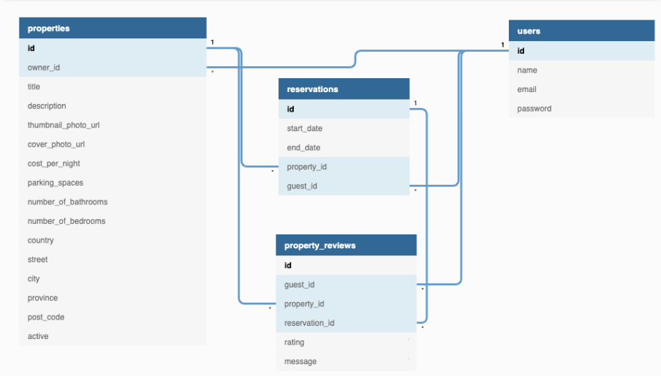

# LightBnB

Lighthouse BnB is an app that will revolutionize the travel industry. It will allow homeowners to rent out their homes to people on vacation, creating an alternative to hotels and bed and breakfasts...There’s nothing else like it! Users can view property information, book reservations, view their reservations, and write reviews.

## LightBnB ERD



## Final Product

### Homepage


### Login Page


### Sign Up Page


### Registered User Page


### Search Page

#### Search Function works without logging in


### Create Listing Page


### My Listings Page


### My Reservations Page


## Project Structure

```
.
├── db
│   ├── json
│   └── database.js
├── public
│   ├── javascript
│   │   ├── components
│   │   │   ├── header.js
│   │   │   ├── login_form.js
│   │   │   ├── new_property_form.js
│   │   │   ├── property_listing.js
│   │   │   ├── property_listings.js
│   │   │   ├── search_form.js
│   │   │   └── signup_form.js
│   │   ├── libraries
│   │   ├── index.js
│   │   ├── network.js
│   │   └── views_manager.js
│   ├── styles
│   │   ├── main.css
│   │   └── main.css.map
│   └── index.html
├── routes
│   ├── apiRoutes.js
│   └── userRoutes.js
├── styles
│   ├── _forms.scss
│   ├── _header.scss
│   ├── _property-listings.scss
│   └── main.scss
├── .gitignore
├── package-lock.json
├── package.json
├── README.md
└── server.js
```

- `db` contains all the database interaction code.
  - `json` is a directory that contains a bunch of dummy data in `.json` files.
  - `database.js` is responsible for all queries to the database. It doesn't currently connect to any database, all it does is return data from `.json` files.
- `public` contains all of the HTML, CSS, and client side JavaScript.
  - `index.html` is the entry point to the application. It's the only html page because this is a single page application.
  - `javascript` contains all of the client side javascript files.
    - `index.js` starts up the application by rendering the listings.
    - `network.js` manages all ajax requests to the server.
    - `views_manager.js` manages which components appear on screen.
    - `components` contains all of the individual html components. They are all created using jQuery.
- `routes` contains the router files which are responsible for any HTTP requests to `/users/something` or `/api/something`.
- `styles` contains all of the sass files.
- `server.js` is the entry point to the application. This connects the routes to the database.

## Dependencies

- express
- cookie-session
- bcrypt
- nodemon
- pg

## Getting Started

1. Install dependencies using the `npm install` command.
2. Start the web server using the `npm run local` command. The app will be served at <http://localhost:3000/>.
3. Go to <http://localhost:3000/> in your browser.
4. Install PostgreSQL and create database called lightbnb from the psql terminal using `CREATE TABLE` statement.
5. Use `\i migrations/01_schema.sql` to add tables.
6. Run `\i seeds/01_seeds.sql` & `\i seeds/02_seeds.sql` to add seed data to lightbnb database.
